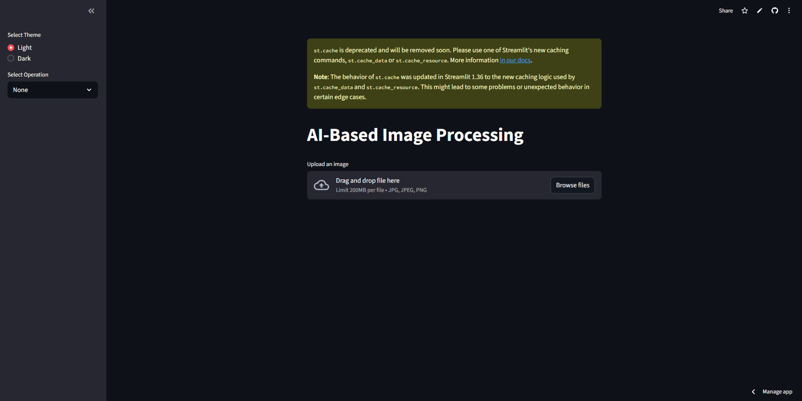
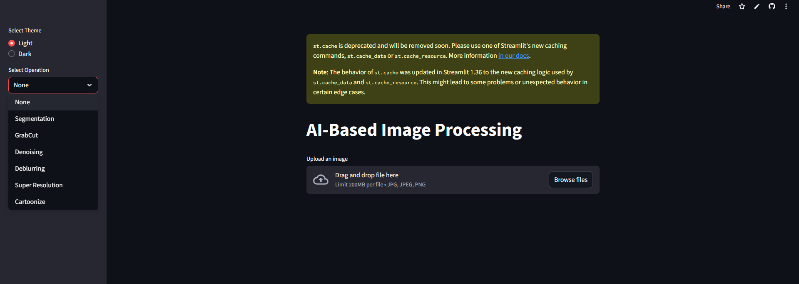
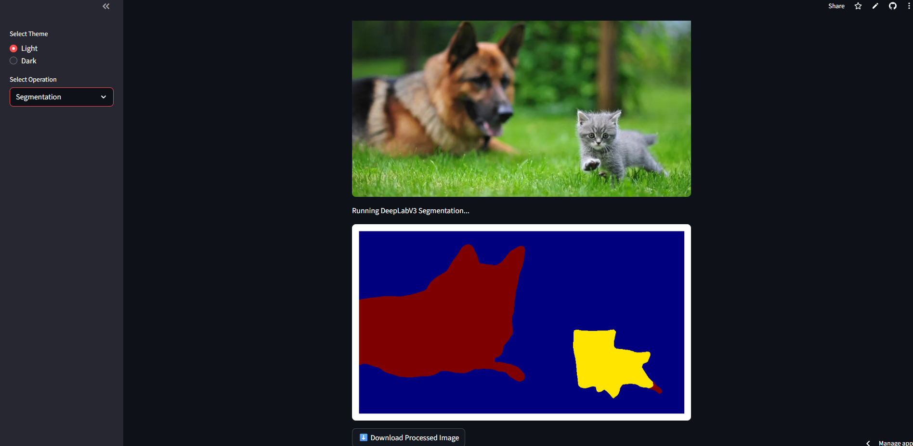
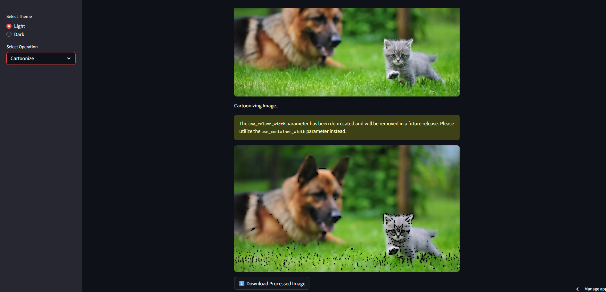

# AI-Based Image Processing App

This is a **Streamlit-based AI Image Processing app**. It allows users to upload an image and apply various AI and computer vision operations. The app features a clean Light/Dark theme and provides an option to download the processed image.

## Features

- **Segmentation** using DeepLabV3 (PyTorch pretrained model)
- **GrabCut Segmentation**
- **Denoising** using OpenCV
- **Deblurring** (motion blur filter using OpenCV)
- **Cartoonize**
- **Super Resolution** (placeholder for future implementation)
- Theme selection: Light / Dark
- Upload → Preview → Process → Download workflow

## How to Run Locally

1. Clone the repository:  
    git clone <your-repo-url>  
    cd <your-repo-folder>

2. Install dependencies:  
    pip install -r requirements.txt

3. Run the app:  
    streamlit run app.py

4. Open the URL shown in terminal (usually http://localhost:8501) in your browser.

## Deployment

- The app can be deployed on **[Streamlit Cloud](https://share.streamlit.io/)**.  
- Simply push your `app.py` and `requirements.txt` to a GitHub repo and connect it to Streamlit Cloud for live hosting.

## Screenshots

## Notes

- This app requires **Python 3.7+**  
- **PyTorch** is used for segmentation  
- **OpenCV** and **PIL** handle image processing tasks  
- “Super Resolution” is a placeholder for future implementation  

---

**Give this repo a star if you like it!**
